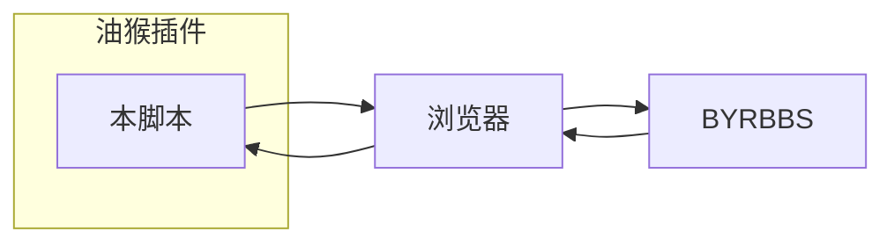

# README
## 1 如何使用
1. 首先需要chromium内核的浏览器(Edge, Chrome等)或者Firefox.
2. 前往[TamperMonkey](https://www.tampermonkey.net/)获取浏览器的TamperMonkey插件。
3. 下载本项目的`main.user.js`，点击油猴图标 - 添加新脚本， 将脚本内容贴入。

> [!warning]
> 油猴脚本具有**访问/修改**您页面上内容、**接收、发送**网络请求的能力。
> 请**不要**安装来路不明的脚本，这可能对您的计算机或财产造成损失。

## 2 实现思路
- 纯前端修改，不含网络请求。

## 3 为什么不 xx

1.  > 为什么不重写一套前端？

    1.  跨域问题。我自己建个站挂上新的前端，对论坛后端的访问是跨域的。 显然我没法解决这个问题（得让论坛的后端工程师把我的站点加入允许的 origin） 或者不想解决这个问题（自己搭个后端服务来转发请求）。
    2.  我的目的并不是重写整个论坛，也不想阅读很多的文档。 这当然是个雄心勃勃的计划，但是我对我个人的生产力水平而言是不现实的。 只想调整一下显示的效果而已，不必为了摘个果子去种一片森林。
    3.  经提示，论坛的重构不是一个技术问题。

2.  > 为什么不用论坛的接口？

    1.  不想抓包/读文档。 论坛的前端和开放的 RESTful 接口是无关的，论坛的前端已经很老了，走的是另一套接口。 如果用老前端的接口，就要抓包自己分析；如果用RESTful接口，按照规则需申请（大伙熟悉的手机APP就是这一套），why bother?

