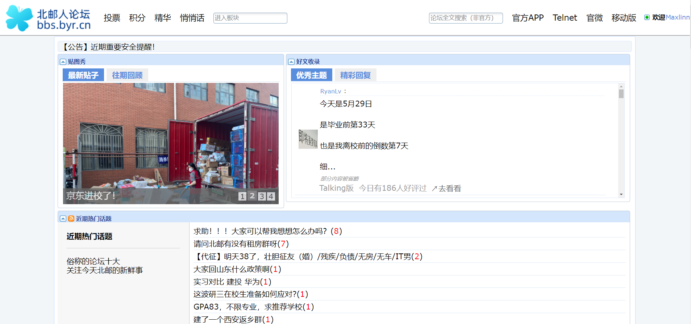
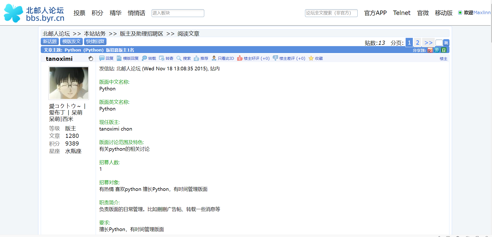
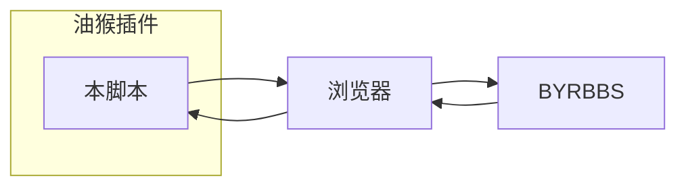

# README

> - 此文档[也发布于此页面](https://maxlinn.github.io/byrbbs-enhance-tmscript)，您可以在浏览器中查看。
> - 也非常欢迎同学们一起维护，提交 Pull Request，不难的看看代码就会~~毕竟 JS 语法炒鸡简单~~。 改进空间请参阅 [6 已知问题和待完成的任务](#6%20已知问题和待完成的任务) 一节。 当然更希望在可见的未来北邮人团队能完全重构论坛前端。
> - 目前能用油猴调整成这样已经不错了，尽量保留了原前端的特性。 想要有颠覆性的改进可能要读原前端的 Javascript 代码。

## 1 展示
### 1.1 论坛主页
- 有时可能脚本没有执行完全，以至于界面比较混搭，此时请<u>刷新</u>。
- 主页保留了拖动调整板块的功能。
    - 但是目前还没有添加新板块的功能。添加时，请在油猴中禁用本脚本，在老界面里调整后再开启此脚本。
    - 原前端的 ` 全部讨论区、我的收藏夹、控制面板 ` 还没有做进去，如果需要使用仍然请禁用本脚本、调整完再启用。
- [论坛全文搜索功能](http://123.207.168.11/byrbbs) 与本人无关，本人对该项目一无所知，对其搜索的内容一无所知，也不保证其长期有效。

### 1.2 帖子列表界面
- 为了论坛内容不外流，这里就不截图了。
- 帖子列表的上下宽度变宽了，相对来说可读性好了很多，~~这个可能是我调字体的 bug 做成的 feature~~.

### 1.3 读贴界面
- 有时去除回复中的 ` 发信人、标题 ` 会没有效果，或者文章的字体没有被替换，此时请<u>刷新</u>。

## 2 如何使用
1.  需要使用 Chromium 内核的浏览器（比如 Edge 和 Google Chrome）或者 Firefox.
2.  前往 [TamperMonkey](https://www.tampermonkey.net/) 获取该浏览器的油猴插件并启用。
3.  点击本项目 Github 仓库中的 `main.user.js`，再点击 `[Raw]`，此时油猴会自动弹出添加脚本页面，点击添加即可。
 > 这是因为油猴会监听对 `<name>.user.js` 的访问，并自动转到安装。
4.  如果 3 中失败了，请下载本项目中的 `main.user.js`，复制其中的内容。然后点击油猴插件图标 - 添加新脚本，将内容粘贴进去即可。

## 3 这是如何实现的？
- TamperMonkey（油猴）是一个特别的浏览器插件，它能让浏览器在特定条件下（比如页面载入时）执行自定义的 `javascript` 脚本。
- 这些脚本可以对页面进行修改（修改 HTML DOM），比如去除页面上的广告；或者发送网络请求，比如同时显示豆瓣和 IMDb 的评分等。
- 所以我使用油猴实现了对北邮人论坛前端进行操纵（添加删除修改），改造了页面。

> 所以油猴脚本具有**访问/修改**您页面上内容、**接收/发送**网络请求的能力。
> 简言之，它会按照脚本内容操纵您的浏览器。
> ==所以请**不要安装来路不明的脚本**，这可能对您的计算机或财产造成损失。==
- 整个过程的示意图如下

## 4 如何证明本脚本是可信的
- 脚本中只从 `jsdelivr` 这一常见源导入了 `jquery` 这一常见库。
- 脚本中不含有网络请求(GET/POST)等，只包含对于 HTML DOM 的操纵。
- 脚本中没用使用任何油猴的高权限 API，也就是声明了 `@grant: none`.
- 脚本是明文的，您可以进行审查。

## 5 Q&A

1.  > 为什么不重写一套前端？

    1.  跨域问题。我自己建个站挂上新的前端，对论坛后端的访问是跨域的。 显然我没法解决这个问题（得让论坛的后端工程师把我的站点加入允许的 origin） 或者不想解决这个问题（自己搭个后端服务来转发请求）。
    2.  我的目的并不是重写整个论坛，也不想阅读很多的文档。 这当然是个雄心勃勃的计划，但是我对我个人的生产力水平而言是不现实的。 只想调整一下显示的效果而已，不必为了摘个果子去种一片森林。
    3.  经提示，论坛的重构有一些困难。

2.  > 为什么不用论坛的接口？

    1.  不想抓包/读文档。论坛的前端和开放的 RESTful 接口是无关的，论坛的前端已经很老了，走的是另一套接口。
    2.  如果用老前端的接口，就要抓包自己分析；如果用 RESTful 接口，还需要按照规则需申请（大伙熟悉的手机 APP 就是这一套）。

## 6 已知问题和待完成的任务

- [ ] #todo 给每个功能加上油猴的开关。
- [ ] #todo 将每个板块的介绍写完，即代码中的 `section_title2desc` 字典。
- [ ] #todo 添加原界面有的 `全部讨论区、我的收藏夹、控制面板` 还没有做进去。
- [ ] #flaw 首页“好文收录”板块和“贴图秀”板块的下部没有对齐。
- [ ] #flaw 首页的版块点击左上的三角进行折叠时，该版块的描述并没有被折叠。
- [ ] #flaw 首页对于在老前端里第二列和第三列的版块，其折叠功能失效。可能是因为本脚本把所有的版块合并到第一列并删除了其他两列。
- [ ] #flaw ` 发文排行榜、挂站排行榜 ` 中每一行的字体被重叠。这是因为该榜单中的单元格其实是写死 `width` 的 `` 元素，在本脚本调整了页面字体后，原先的 width 不够用了。
- [ ] #flaw 有时脚本的部分功能需要刷新才能起作用，比如替换页面字体，尚不明确原因。
